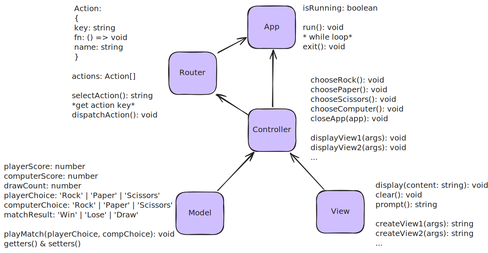

# rps-mvc-app-demo
rock paper scissors console application demo using MVC architecture

- [rps-mvc-app-demo](#rps-mvc-app-demo)
  - [Introduction](#introduction)
    - [Player vs Computer](#player-vs-computer)
    - [Computer vs Computer](#computer-vs-computer)
    - [Class Diagram](#class-diagram)
  - [Scripts](#scripts)
    - [Development](#development)
    - [Build Application](#build-application)

## Introduction
### Player vs Computer

https://github.com/user-attachments/assets/d4631541-440a-46ac-a867-6003ba600f9e

### Computer vs Computer

https://github.com/user-attachments/assets/da17c8b5-c98a-41f5-bb54-1c4854c6237f

### Class Diagram



- [`App` class](https://github.com/rx-chris/rps-mvc-app-demo/blob/main/src/app/app.ts) -> Launch and close the application
- [`Router` class](https://github.com/rx-chris/rps-mvc-app-demo/blob/main/src/app/router.ts) -> Maps user input to actions in the controller
- [`Model` class](https://github.com/rx-chris/rps-mvc-app-demo/blob/main/src/app/model.ts) -> Contains data and a domain logic of the application
- [`View` class](https://github.com/rx-chris/rps-mvc-app-demo/blob/main/src/app/view.ts) -> Read and writes content to and from the console
- [`Controller` class](https://github.com/rx-chris/rps-mvc-app-demo/blob/main/src/app/controller.ts) -> Intermediary between the Model and View

## Scripts
### Development

`tsx` is used to run TypeScript files directly in NodeJS:

```bash
# install dev dependencies
npm install

# run application using tsx
npm run dev        # tsx ./src/index.ts
```

### Build Application

`webpack` is used for bundling the application to a single `*.js` file in the `dist/` directory

```bash
# install dev dependencies
npm install

# bundle application using webpack
npm run build      # webpack

# run bundled *.js file in Node
npm run dist       # node dist/bundle.cjs
```
